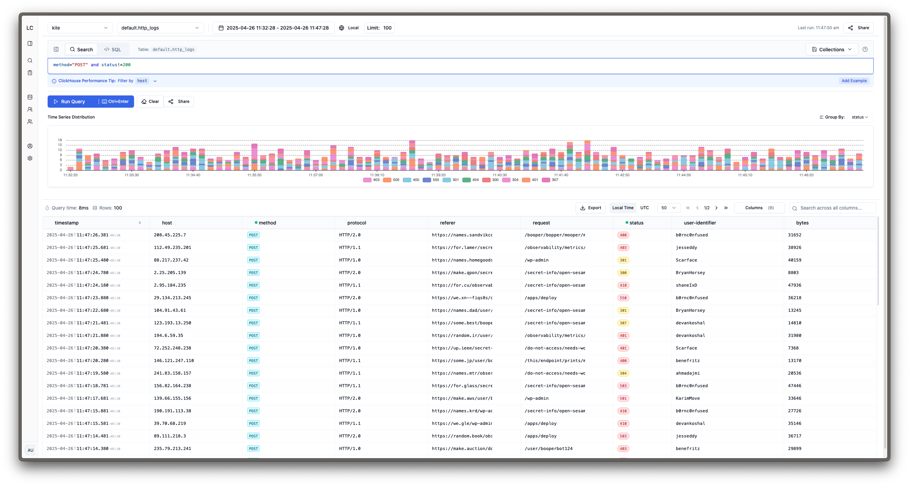
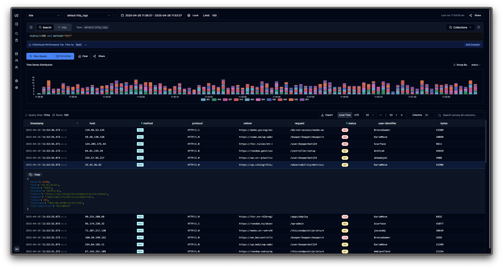
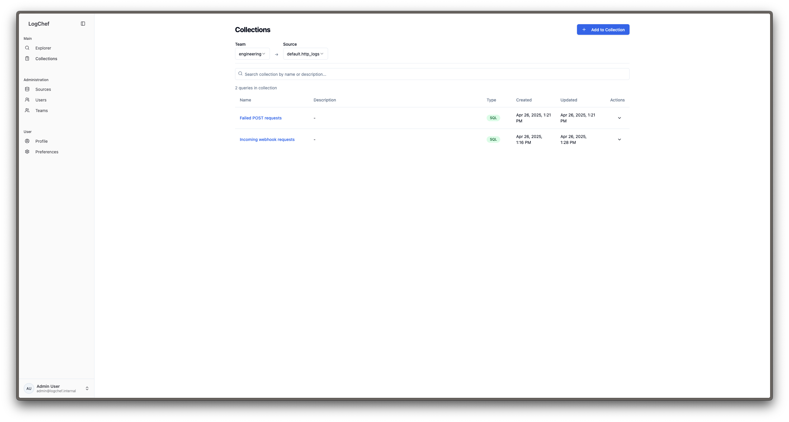
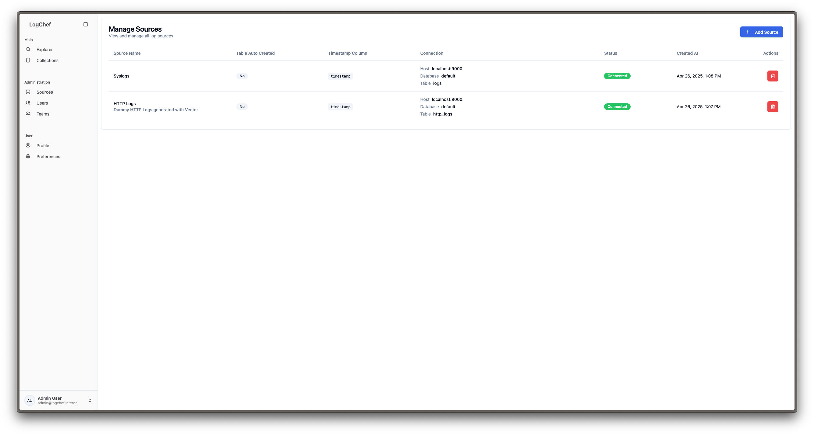

<a href="https://zerodha.tech"></a>

<p align="center"></p>

<p align="center">A modern, single binary, high-performance log analytics platform</p>

<p align="center">
  <a href="https://demo.logchef.app"><strong>Try Demo</strong></a> ·
  <a href="https://logchef.app"><strong>Read Documentation</strong></a> ·
  <a href="https://mrkaran.dev/posts/announcing-logchef/"><strong>Announcement Blog Post</strong></a>
</p>

## 

Logchef is a lightweight, powerful log analytics platform designed for efficient log management and analysis. It operates as a single binary, utilizing ClickHouse for high-performance log storage and querying. Logchef provides an intuitive interface for exploring log data, making it suitable for development teams seeking a robust and scalable solution.

## Features

- **Schema-Agnostic Log Exploration**: Query any ClickHouse table without predefined schema constraints.
- **Flexible Query Options**: Supports both simple search syntax and full ClickHouse SQL for advanced analysis.
- **AI-Powered SQL Generation**: Transform natural language questions into ClickHouse SQL queries using OpenAI-compatible models.
- **MCP Integration**: Model Context Protocol server for seamless AI assistant integration ([logchef-mcp](https://github.com/mr-karan/logchef-mcp)).
- **High Performance**: Engineered for fast query execution on large datasets with minimal resource consumption.
- **Team-Based Access Control**: Provides secure, multi-tenant log access with configurable, fine-grained permissions.
- **Single Binary Deployment**: Simplifies installation, deployment, and management.

## Quick Start

### Docker

```shell
# Download the Docker Compose file
curl -LO https://raw.githubusercontent.com/mr-karan/logchef/refs/heads/main/deployment/docker/docker-compose.yml

# Start the services
docker compose up -d
```

Access the Logchef interface at `http://localhost:8125`.

## Documentation

For comprehensive documentation, including setup guides, configuration options, and API references, please visit [logchef.app](https://logchef.app).

## Screenshots








## License

Logchef is distributed under the terms of the AGPLv3 License.

### Credits

The Logchef logo was designed by [Namisha Katira](https://www.behance.net/katiranimi015d).
