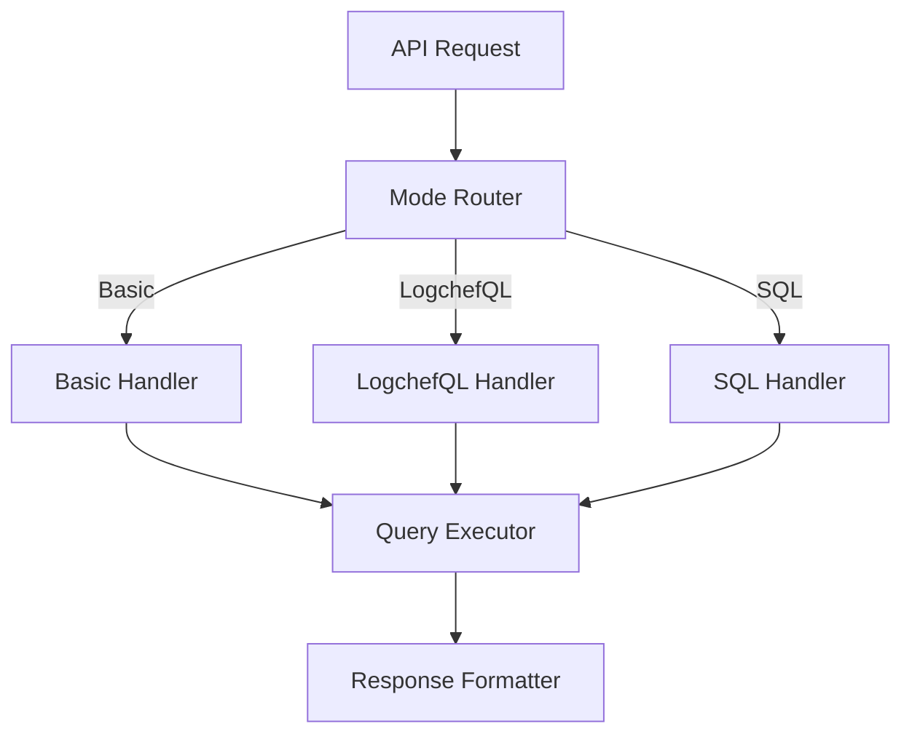

# LogchefQL API Integration: Design Document

**Author:** System Architect
**Date:** 2024-03-19
**Task ID/Reference:** LOGCHEF-QL-API

## 1. Overview

**Goal:**
Enhance the existing `/api/v1/sources/:sourceId/logs` endpoint to support three query modes while maintaining a consistent interface.

**Context:**
The current API supports basic log fetching. This enhancement adds LogchefQL and raw SQL support through a unified endpoint.

**Key Outcomes:**
- Single unified endpoint with three query modes
- Consistent response format across modes
- Safe execution of all query types
- Query validation and preview capabilities
- Optimized query execution layer

## 2. Background & Motivation

**Current State:**
```go
// Current API Structure
GET /api/v1/sources/:sourceId/logs?start_time=...&end_time=...&service_name=...
```

**Query Modes:**
1. **Basic Mode (Existing)**
   - URL parameters for filtering
   - Simple pagination
   - Time range filtering

2. **LogchefQL Mode (New)**
   - Human-readable query language
   - Complex filtering capabilities
   - JSON path support

3. **Raw SQL Mode (New)**
   - Direct ClickHouse SQL
   - Read-only queries
   - Advanced aggregations

## 3. Requirements

**Functional Requirements:**

```go
// Unified Request Structure
POST /api/v1/sources/:sourceId/logs
{
    "mode": "basic|logchefql|sql",  // Required
    "query": "string",              // Required for logchefql/sql modes
    "preview": false,               // Optional
    "params": {                     // Optional
        "start_time": "2024-03-19T00:00:00Z",
        "end_time": "2024-03-19T23:59:59Z",
        "limit": 100,
        "offset": 0
    }
}
```

**Mode-Specific Requirements:**
1. **Basic Mode**
   - Maintain backward compatibility
   - Support existing filters
   - Optional query parameter

2. **LogchefQL Mode**
   - Parse and validate LogchefQL syntax
   - Transform to optimized SQL
   - Support all LogchefQL features

3. **Raw SQL Mode**
   - Validate query is SELECT only
   - Prevent DDL/DML operations
   - Table name validation
   - Parameter binding support

## 4. Proposed Solution

**Architecture:**


**Common Components:**

```go
// Query executor interface
type QueryExecutor interface {
    Execute(ctx context.Context, req *QueryRequest) (*QueryResponse, error)
    Preview(ctx context.Context, req *QueryRequest) (*QueryPreview, error)
}

// Base handler structure
type LogHandler struct {
    executor    QueryExecutor
    sourceRepo  *models.SourceRepository
    validators  map[QueryMode]QueryValidator
}

// Mode-specific validator interface
type QueryValidator interface {
    Validate(ctx context.Context, req *QueryRequest) error
}
```

**Security Layer:**
```go
// SQL validator
type SQLValidator struct {
    // Forbidden patterns
    forbiddenPatterns []string
    // Allowed tables map
    allowedTables map[string]bool
}

func (v *SQLValidator) Validate(query string) error {
    // Check for DDL/DML operations
    if containsPattern(query, v.forbiddenPatterns) {
        return ErrForbiddenOperation
    }
    // Validate table access
    if !v.isTableAllowed(extractTable(query)) {
        return ErrTableNotAllowed
    }
    return nil
}
```

## 5. Implementation Plan

1. **Refactor Existing Code:**
```go
// Extract common query execution logic
type QueryExecutor struct {
    pool      *db.ConnectionPool
    validator QueryValidator
}

// Create mode-specific handlers
func (h *LogHandler) handleBasicMode(c echo.Context, req *QueryRequest) error {
    // Use existing logic but conform to new interface
}

func (h *LogHandler) handleLogchefQLMode(c echo.Context, req *QueryRequest) error {
    // Parse LogchefQL and execute
}

func (h *LogHandler) handleSQLMode(c echo.Context, req *QueryRequest) error {
    // Validate and execute raw SQL
}
```

2. **Common Execution Layer:**
```go
func (e *QueryExecutor) Execute(ctx context.Context, req *QueryRequest) (*QueryResponse, error) {
    // Common execution logic:
    // 1. Get connection from pool
    // 2. Apply timeout
    // 3. Execute query
    // 4. Format response
}
```

3. **Error Handling:**
```go
type QueryError struct {
    Code      string    `json:"code"`
    Message   string    `json:"message"`
    Mode      QueryMode `json:"mode"`
    Details   string    `json:"details,omitempty"`
    Position  int       `json:"position,omitempty"`
}

var (
    ErrInvalidMode = &QueryError{Code: "INVALID_MODE"}
    ErrSyntaxError = &QueryError{Code: "SYNTAX_ERROR"}
    ErrForbiddenSQL = &QueryError{Code: "FORBIDDEN_SQL"}
)
```

## 6. Testing Strategy

**Unit Tests:**
```go
func TestQueryModes(t *testing.T) {
    tests := []struct {
        name     string
        mode     QueryMode
        query    string
        wantSQL  string
        wantErr  error
    }{
        {
            name:    "basic mode with filters",
            mode:    QueryModeBasic,
            query:   "",
            params:  map[string]string{"service_name": "api"},
            wantSQL: "SELECT * FROM logs WHERE service_name = ?",
        },
        {
            name:    "logchefql valid query",
            mode:    QueryModeLogchefQL,
            query:   "service_name='api';severity='error'",
            wantSQL: "SELECT * FROM logs WHERE service_name = ? AND severity = ?",
        },
        {
            name:    "sql mode forbidden operation",
            mode:    QueryModeSQL,
            query:   "DROP TABLE logs",
            wantErr: ErrForbiddenSQL,
        },
    }
}
```

## 7. Migration Plan

1. **Phase 1: Refactoring**
   - Extract common query execution logic
   - Create interfaces for validators
   - Update existing basic mode handler

2. **Phase 2: New Modes**
   - Implement LogchefQL mode
   - Implement SQL mode
   - Add comprehensive tests

3. **Phase 3: Documentation**
   - Update API documentation
   - Add query examples
   - Document security considerations

## 8. Security Considerations

1. **SQL Injection Prevention:**
   - Parameter binding for all modes
   - Table name validation
   - Query sanitization

2. **Resource Protection:**
   - Query timeout limits
   - Result size limits
   - Rate limiting per source

3. **Access Control:**
   - Table-level access control
   - Mode-specific permissions
   - Audit logging

## 9. Monitoring

1. **Metrics:**
   - Query execution time by mode
   - Error rates by mode
   - Resource usage patterns
   - Slow query tracking

2. **Alerts:**
   - High error rates
   - Slow queries
   - Resource exhaustion
   - Security violations

## 10. Open Questions

1. Should we support parameterized queries in SQL mode?
2. How to handle schema changes during query execution?
3. Should we implement query result caching?
4. How to optimize query execution plans across modes?

---

This design provides a unified approach to log querying while maintaining security, performance, and usability across all query modes.