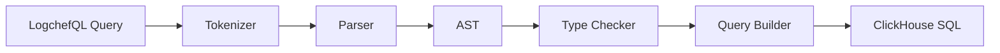

# LogchefQL Query Language: Design Document

**Author:** System Architect
**Date:** 2024-12-16
**Task ID/Reference:** LOGCHEF-1

## 1. Overview

**Goal:**
Implement a lightweight query language (LogchefQL) for Logchef that translates human-readable filter expressions into optimized ClickHouse SQL queries.

**Context:**
Logchef currently supports basic filtering through direct query parameters. Adding LogchefQL will provide users with a more powerful and intuitive way to query logs while ensuring query optimization and type safety.

**Key Outcomes / Success Criteria:**
- Support all basic operators (=, !=, ~, !~) with 99.9% accuracy in translation
- Query execution time within 120% of direct SQL queries
- Zero SQL injection vulnerabilities

## 2. Background & Motivation

**Current State:**
- Basic filtering through direct parameters (service_name, namespace, severity_text)
- Simple text search with ILIKE on body field
- No support for complex conditions or nested field queries
- Limited operator support

**Why This Task:**
- Users need more powerful filtering capabilities
- Current implementation doesn't support nested field queries
- Need better type safety and query optimization
- Reduce complexity of building complex queries programmatically

## 3. Requirements

**Functional Requirements:**
- Parse LogchefQL syntax: `field_name operator 'value'`
- Support operators: =, !=, ~, !~
- Handle multiple conditions with semicolon separator
- Support nested field access (p.error)
- Support map field access (log_attributes)
- Type-safe value parsing
- Proper escaping of values

**Non-Functional Requirements:**
- Query parsing under 1ms
- Generated SQL must use appropriate indexes
- Memory usage under 1MB per query
- Thread-safe implementation

## 4. Proposed Solution

**High-Level Approach:**
1. Create a tokenizer for breaking down LogchefQL strings
2. Implement a recursive descent parser
3. Build an AST (Abstract Syntax Tree)
4. Implement SQL generator with type checking
5. Add query optimization layer

**Architecture:**



**Data Structures:**

```go
// Core types for the query language
type TokenType int

const (
    FIELD TokenType = iota
    OPERATOR
    VALUE
    SEPARATOR
)

type Token struct {
    Type     TokenType
    Value    string
    Position int
}

type Node interface {
    Type() NodeType
    String() string
}

type FilterNode struct {
    Field    string
    Operator string
    Value    interface{}
}

// Query builder with schema awareness
type QueryBuilder struct {
    schema  []models.LogSchema
    params  []interface{}
}
```

**Error Handling & Edge Cases:**
- Invalid syntax: Return detailed parsing errors with position information
- Unknown fields: Validate against schema before query execution
- Type mismatches: Strict type checking based on ClickHouse schema
- Empty/null values: Proper NULL handling in ClickHouse
- Map access validation: Verify log_attributes key existence
- JSON path validation: Verify nested field paths exist

## 5. Detailed Steps / Implementation Plan

1. **Create Core Parser Package:**
   - Implement tokenizer with position tracking
   - Create AST node structures
   - Build recursive descent parser
   - Add error recovery mechanisms

2. **Implement Type System:**
   - Create type registry mapping LogchefQL types to ClickHouse types
   - Add validation rules for each operator
   - Implement type inference for nested fields
   - Add schema validation layer

3. **Build Query Generator:**
   - Create SQL template system
   - Implement parameter binding
   - Add index-aware query optimization
   - Handle special cases (map access, JSON paths)

4. **Integration with Existing Codebase:**
   - Add new LogchefQL parser package
   - Modify LogHandler to use new query parser
   - Update repository layer for optimized queries
   - Add query validation middleware

## 6. Testing Strategy

**Test Cases:**

```go
// Parser tests
"service_name='api'"                -> "WHERE service_name = ?"
"body~'error'"                      -> "WHERE body ILIKE ?"
"log_attributes['client']='mobile'" -> "WHERE log_attributes['client'] = ?"
"p.error!='null'"                  -> "WHERE JSONExtractString(body, 'error') != ?"

// Complex queries
"service_name='api';severity_text='error'" ->
    "WHERE service_name = ? AND severity_text = ?"

// Edge cases
"invalid_field='value'"    -> Error: Unknown field
"timestamp>'not_a_date'"   -> Error: Invalid timestamp format
```

**Performance Testing:**
- Benchmark parsing speed with large queries
- Compare generated SQL performance with direct queries
- Test with high-volume log data
- Measure memory usage under load

## 7. Dependencies & Integration

- Existing Logchef components:
  - ClickHouse connection pool
  - Schema management system
  - Log repository layer
  - API handlers
- New dependencies:
  - Parser generator tools (optional)
  - Query optimization libraries (optional)

## 8. Deployment & Rollout Plan

1. **Phase 1: Alpha Release**
   - Release parser library
   - Add basic query support
   - Internal testing only

2. **Phase 2: Beta Release**
   - Enable for select users
   - Monitor performance
   - Gather feedback

3. **Phase 3: General Release**
   - Enable for all users
   - Add query complexity limits
   - Monitor system health

## 9. Maintenance & Support

**Monitoring Metrics:**
- Query parsing errors (rate, types)
- Execution times (p95, p99)
- Memory usage per query
- Error rates by query type
- Index usage statistics

**Documentation:**
- LogchefQL syntax reference
- Query examples and best practices
- Performance optimization guide
- Troubleshooting guide

## 10. Open Questions & Assumptions

1. **Query Language Extensions:**
   - Should we support boolean operators (AND/OR) in future versions?
   - How to handle complex time-based queries?

2. **Performance Considerations:**
   - Maximum query complexity limits?
   - Caching strategy for repeated queries?
   - Impact on ClickHouse connection pool?

3. **Schema Evolution:**
   - How to handle schema changes?
   - Version compatibility strategy?

4. **Security:**
   - Query sanitization requirements?
   - Access control integration?

## 11. LogchefQL Grammar & Parsing

**EBNF Grammar:**
```ebnf
query           = condition (";" condition)*
condition       = field operator value
field           = simple_field | map_field | json_field | array_field | time_field
simple_field    = identifier
map_field       = identifier "[" string_literal "]"
json_field      = identifier ("." identifier)*
array_field     = identifier "[]"
time_field      = "timestamp"
operator        = "=" | "!=" | "~" | "!~" | "=~" | ">=" | "<=" | ">" | "<"
value           = string_literal | number_literal | time_literal | regex_pattern | relative_time
string_literal  = "'" [^']* "'"
number_literal  = [0-9]+ ("." [0-9]*)?
time_literal    = timestamp_format | relative_time
relative_time   = "-" [0-9]+ ("s" | "m" | "h" | "d")
regex_pattern   = "~/" [^/]* "/"
```

**Parser Implementation:**
```go
// Core parser types
type TokenType int

const (
    IDENTIFIER TokenType = iota
    OPERATOR
    STRING_LITERAL
    NUMBER_LITERAL
    TIME_LITERAL
    REGEX_PATTERN
    MAP_START
    MAP_END
    DOT
    SEMICOLON
)

// AST nodes
type Node interface {
    ToSQL() (string, []interface{})
}

type Condition struct {
    Field    Field
    Operator string
    Value    Value
}

type Field interface {
    Node
    IsField() bool
}

type MapField struct {
    Name string
    Key  string
}

type JSONField struct {
    Path []string
}

type ArrayField struct {
    Name string
}
```

## 12. Query Examples & Capabilities

**1. Simple Field Queries:**
```sql
-- Exact match
service_name='api-server'
severity_text='error'

-- Pattern match
message~'connection timeout'
body!~'health check'
```

**2. Map Field Access:**
```sql
-- Exact match on map field
log_attributes['client_ip']='192.168.1.1'
log_attributes['status_code']=500

-- Pattern match in map value
log_attributes['user_agent']~'Mozilla'
log_attributes['error_type']!~'expected'
```

**3. JSON Path Queries:**
```sql
-- Nested field access
p.error.code=500
p.request.headers.x_forwarded_for~'10.0.'

-- Multiple levels
p.user.preferences.theme='dark'
p.error.stack_trace~'null pointer'
```

**4. Array Operations:**
```sql
-- Array contains
tags[]='error'
labels[]='production'

-- Pattern match in array
tags[]=~'warn'
monitored_services[]~'api'
```

**5. Time-Based Queries:**
```sql
-- Absolute time
timestamp>'2024-01-01T00:00:00Z'
timestamp<='2024-12-31T23:59:59Z'

-- Relative time
timestamp>-1h    -- Last hour
timestamp>-15m   -- Last 15 minutes
timestamp>-7d    -- Last 7 days
```

**6. Regular Expression Patterns:**
```sql
-- Regex match on fields
service_name=~/^api-v[0-9]+$/
path=~/^\/api\/users\/[0-9]+$/

-- Complex patterns
body=~/\b\d{3}-\d{2}-\d{4}\b/  -- Match SSN pattern
url=~/\.(jpg|png|gif)$/i       -- Case-insensitive file extension
```

**7. Combined Queries:**
```sql
-- Multiple conditions
service_name='payment-api';severity_text='error';timestamp>-1h

-- Map and JSON combinations
log_attributes['env']='prod';p.error.code=500

-- Complex time and pattern
timestamp>-24h;body~'error';log_attributes['status_code']=500
```

**8. Special Functions:**
```sql
-- Count aggregation
count(severity_text='error')>100

-- Unique values
unique(user_id)>50

-- Pattern matching with context
body=~"error AND (timeout OR connection)"
```

Each query type is translated into optimized ClickHouse SQL using our query builder and type system. The parser validates field names against the schema, ensures type safety, and applies appropriate escaping and parameter binding.

## 13. Parser Generator & SQL Builder Implementation

### Parser Generator Selection
We've chosen Participle as our parser generator for LogchefQL for the following reasons:
- Pure Go implementation with no external dependencies
- Grammar defined directly in Go using struct tags
- Excellent error reporting and position tracking
- Sufficient power for our grammar needs
- Easy maintenance and modification

### SQL Builder Implementation
We use `go-sqlbuilder` combined with custom ClickHouse-specific logic to ensure both SQL injection protection and proper handling of specialized features:

```go
// builder/sql.go

package builder

import (
    "github.com/huandu/go-sqlbuilder"
    "time"
)

// LogchefSQLBuilder combines go-sqlbuilder with ClickHouse specifics
type LogchefSQLBuilder struct {
    builder *sqlbuilder.SelectBuilder
    schema  *models.LogSchema
    params  []interface{}
}

func NewLogchefSQLBuilder(schema *models.LogSchema) *LogchefSQLBuilder {
    return &LogchefSQLBuilder{
        builder: sqlbuilder.NewSelectBuilder(),
        schema:  schema,
    }
}

// AddCondition safely adds conditions with SQL injection protection
func (b *LogchefSQLBuilder) AddCondition(field string, op string, value interface{}) error {
    // Validate field against schema
    if !b.schema.HasField(field) {
        return fmt.Errorf("unknown field: %s", field)
    }

    switch {
    case strings.Contains(field, "log_attributes"):
        // Safe map access using go-sqlbuilder's Cond
        key := extractKey(field)
        cond := sqlbuilder.NewCond("log_attributes[?]", key)
        if op == "~" {
            b.builder.Where(cond.Like(fmt.Sprintf("%%%v%%", value)))
        } else {
            b.builder.Where(cond.Op(op, value))
        }

    case strings.HasPrefix(field, "p."):
        // Safe JSON path handling
        path := strings.TrimPrefix(field, "p.")
        cond := sqlbuilder.NewCond("JSONExtractString(body, ?)", path)
        b.builder.Where(cond.Op(op, value))

    case strings.HasSuffix(field, "[]"):
        // Safe array operations
        arrayField := strings.TrimSuffix(field, "[]")
        b.builder.Where(
            sqlbuilder.Build("hasElement(?, ?)", arrayField, value),
        )

    case field == "timestamp":
        if err := b.addTimeCondition(op, value); err != nil {
            return err
        }

    default:
        // Standard field comparison with SQL injection protection
        cond := sqlbuilder.NewCond(field)
        if op == "~" {
            b.builder.Where(cond.Like(fmt.Sprintf("%%%v%%", value)))
        } else {
            b.builder.Where(cond.Op(op, value))
        }
    }

    return nil
}

// addTimeCondition handles timestamp operations safely
func (b *LogchefSQLBuilder) addTimeCondition(op string, value interface{}) error {
    switch v := value.(type) {
    case string:
        if strings.HasPrefix(v, "-") {
            duration, err := parseRelativeTime(v)
            if err != nil {
                return err
            }
            // Safe time interval handling
            b.builder.Where(
                sqlbuilder.Build("timestamp ? now() - INTERVAL ?", op, duration),
            )
        } else {
            cond := sqlbuilder.NewCond("timestamp")
            b.builder.Where(cond.Op(op, v))
        }
    default:
        return fmt.Errorf("invalid timestamp value: %v", value)
    }
    return nil
}

// Build returns the final SQL with proper parameter binding
func (b *LogchefSQLBuilder) Build() (string, []interface{}) {
    return b.builder.Build()
}
```

### Integration Example
```go
// Example usage in repository layer
func (r *LogRepository) QueryLogs(ctx context.Context, query *parser.Query) ([]*models.Log, error) {
    builder := NewLogchefSQLBuilder(r.schema)

    // Safe query building
    for _, condition := range query.Conditions {
        if err := builder.AddCondition(
            condition.Field,
            condition.Operator,
            condition.Value,
        ); err != nil {
            return nil, fmt.Errorf("invalid condition: %w", err)
        }
    }

    // Get safe SQL and bound parameters
    sql, args := builder.Build()

    // Execute with proper parameter binding
    rows, err := r.db.QueryContext(ctx, sql, args...)
    if err != nil {
        return nil, err
    }
    defer rows.Close()

    // Process results...
}
```

## 14. Security Considerations

### SQL Injection Protection
The implementation uses multiple layers of protection against SQL injection:

1. **Parameter Binding:**
   - All user inputs are passed as bound parameters
   - No direct string interpolation in SQL
   - Uses go-sqlbuilder's safe parameter handling

2. **Field Validation:**
   ```go
   // Schema-based field validation
   if !b.schema.HasField(field) {
       return fmt.Errorf("unknown field: %s", field)
   }
   ```

3. **Operator Whitelisting:**
   ```go
   // Valid operators are strictly controlled
   var validOperators = map[string]string{
       "=":  "=",
       "!=": "<>",
       "~":  "ILIKE",
       "!~": "NOT ILIKE",
       ">":  ">",
       "<":  "<",
       ">=": ">=",
       "<=": "<=",
   }
   ```

4. **Special Character Handling:**
   - Map keys are properly escaped
   - JSON paths are sanitized
   - Array operations use safe functions

### Example Security Scenarios:

1. **Attempted SQL Injection:**
```sql
-- User input:
service_name='api'; DROP TABLE logs;--'

-- Safe handling:
WHERE service_name = ? -- Parameters safely bound
```

2. **Map Field Injection:**
```sql
-- User input:
log_attributes['key'] = 'value'; DELETE FROM logs;--']

-- Safe handling:
WHERE log_attributes[?] = ? -- Both key and value safely bound
```

3. **JSON Path Injection:**
```sql
-- User input:
p.malicious.field'); DROP TABLE logs;--

-- Safe handling:
WHERE JSONExtractString(body, ?) = ? -- Path safely bound
```

### Security Best Practices:
1. All user inputs are treated as potentially malicious
2. Schema validation before query building
3. Proper parameter binding for all values
4. No direct string concatenation in SQL
5. Regular security audits of query patterns
6. Comprehensive logging of query patterns
7. Rate limiting on complex queries

## 15. Complex Query Examples & SQL Translations

### 1. Nested Conditions with Multiple Map Fields
```sql
-- LogchefQL:
log_attributes['env']='prod';
log_attributes['pod_name']~'api-';
log_attributes['client_version']>='2.0.0'

-- Translates to ClickHouse SQL:
WHERE log_attributes['env'] = ?
  AND log_attributes['pod_name'] ILIKE ?
  AND log_attributes['client_version'] >= ?
-- With parameters: ['prod', '%api-%', '2.0.0']
```

### 2. Deep JSON Path with Array Operations
```sql
-- LogchefQL:
p.request.headers.accept[]~'application/json';
p.response.data.items[].status='failed'

-- Translates to ClickHouse SQL:
WHERE arrayExists(x -> x ILIKE ?, JSONExtractArray(body, 'request.headers.accept'))
  AND arrayExists(x -> x = ?, JSONExtractArray(body, 'response.data.items.status'))
-- With parameters: ['%application/json%', 'failed']
```

### 3. Time-based Pattern Analysis
```sql
-- LogchefQL:
timestamp>-1h;
severity_text='error';
body~'connection refused' AND 'timeout';
p.retries>3

-- Translates to ClickHouse SQL:
WHERE timestamp > (now() - INTERVAL 1 HOUR)
  AND severity_text = ?
  AND (body ILIKE ? AND body ILIKE ?)
  AND JSONExtractInt(body, 'retries') > ?
-- With parameters: ['error', '%connection refused%', '%timeout%', 3]
```

### 4. Complex Log Attribute Patterns
```sql
-- LogchefQL:
log_attributes['k8s.namespace']='production';
log_attributes['k8s.container.name']~'api-';
p.error.type='ConnectionError';
p.error.attempts>5;
body~'retry exhausted'

-- Translates to ClickHouse SQL:
WHERE log_attributes['k8s.namespace'] = ?
  AND log_attributes['k8s.container.name'] ILIKE ?
  AND JSONExtractString(body, 'error.type') = ?
  AND JSONExtractInt(body, 'error.attempts') > ?
  AND body ILIKE ?
-- With parameters: ['production', '%api-%', 'ConnectionError', 5, '%retry exhausted%']
```

### 5. Mixed Field Types and Operations
```sql
-- LogchefQL:
service_name=~/^api-v[0-9]+$/;
log_attributes['deployment']='canary';
p.metrics.latency>1000;
p.metrics.status_codes[]='503';
timestamp>-15m

-- Translates to ClickHouse SQL:
WHERE match(service_name, ?)
  AND log_attributes['deployment'] = ?
  AND JSONExtractFloat(body, 'metrics.latency') > ?
  AND arrayExists(x -> x = ?, JSONExtractArray(body, 'metrics.status_codes'))
  AND timestamp > (now() - INTERVAL 15 MINUTE)
-- With parameters: ['^api-v[0-9]+$', 'canary', 1000, '503']
```

### Performance Considerations for Complex Queries

1. **Index Usage:**
   - Map access uses bloom filter index on keys
   - JSON path queries benefit from tokenized body index
   - Timestamp range uses primary index
   - Service name and severity use set index

2. **Query Optimization:**
   - Conditions ordered by selectivity
   - Array operations pushed after filtering
   - JSON extraction minimized
   - Pattern matching optimized with indexes

3. **Resource Management:**
   - Complex queries may have higher memory usage
   - JSON path traversal can be CPU intensive
   - Array operations scale with array size
   - Regular expression matching carefully bounded

## 16. Real-World Query Scenarios

### 1. Kubernetes Pod Troubleshooting
```sql
-- Scenario: Debug network issues in payment service pods
-- LogchefQL:
log_attributes['k8s.namespace']='production';
log_attributes['k8s.pod.name']~'payment-service-';
severity_text='error';
body~'connection refused|timeout';
timestamp>-30m;
p.error.retry_count>3

-- Translates to ClickHouse SQL:
WHERE log_attributes['k8s.namespace'] = ?
  AND log_attributes['k8s.pod.name'] ILIKE ?
  AND severity_text = ?
  AND multiSearchAny(body, ?)
  AND timestamp > (now() - INTERVAL 30 MINUTE)
  AND JSONExtractInt(body, 'error.retry_count') > ?
-- With parameters: ['production', '%payment-service-%', 'error',
--                  ['connection refused', 'timeout'], 3]

-- Use Case:
-- - Identify network-related issues in payment service
-- - Focus on errors with multiple retry attempts
-- - Recent issues within last 30 minutes
```

### 2. API Gateway Error Investigation
```sql
-- Scenario: Track failed requests with latency issues
-- LogchefQL:
log_attributes['service']='api-gateway';
p.response.status_code>=500;
p.request.client_ip~'10.0.';
p.metrics.latency>1000;
p.request.headers['x-correlation-id']='abc123';
timestamp>-1h

-- Translates to ClickHouse SQL:
WHERE log_attributes['service'] = ?
  AND JSONExtractInt(body, 'response.status_code') >= ?
  AND JSONExtractString(body, 'request.client_ip') ILIKE ?
  AND JSONExtractFloat(body, 'metrics.latency') > ?
  AND JSONExtractString(body, 'request.headers.x-correlation-id') = ?
  AND timestamp > (now() - INTERVAL 1 HOUR)
-- With parameters: ['api-gateway', 500, '%10.0.%', 1000, 'abc123']

-- Use Case:
-- - Track 5xx errors in API gateway
-- - Focus on high-latency requests
-- - Trace specific request through correlation ID
```

### 3. Authentication Service Security Analysis
```sql
-- Scenario: Detect potential brute force attacks
-- LogchefQL:
service_name='auth-service';
p.event.type='login_failed';
p.user.attempts>5;
log_attributes['source_ip']~'192.168.';
p.error.code='invalid_credentials';
timestamp>-24h

-- Translates to ClickHouse SQL:
WHERE service_name = ?
  AND JSONExtractString(body, 'event.type') = ?
  AND JSONExtractInt(body, 'user.attempts') > ?
  AND log_attributes['source_ip'] ILIKE ?
  AND JSONExtractString(body, 'error.code') = ?
  AND timestamp > (now() - INTERVAL 24 HOUR)
-- With parameters: ['auth-service', 'login_failed', 5, '%192.168.%',
--                  'invalid_credentials']

-- Use Case:
-- - Detect potential security breaches
-- - Track failed login patterns
-- - Identify suspicious IP addresses
```

### 4. Microservice Communication Debug
```sql
-- Scenario: Trace inter-service communication issues
-- LogchefQL:
log_attributes['env']='staging';
service_name=~/^(user|order|payment)-service$/;
p.trace.parent_id='xyz789';
p.metrics.downstream_latency>500;
body~'circuit breaker|fallback';
timestamp>-15m

-- Translates to ClickHouse SQL:
WHERE log_attributes['env'] = ?
  AND match(service_name, ?)
  AND JSONExtractString(body, 'trace.parent_id') = ?
  AND JSONExtractFloat(body, 'metrics.downstream_latency') > ?
  AND multiSearchAny(body, ?)
  AND timestamp > (now() - INTERVAL 15 MINUTE)
-- With parameters: ['staging', '^(user|order|payment)-service$', 'xyz789',
--                  500, ['circuit breaker', 'fallback']]

-- Use Case:
-- - Debug service mesh issues
-- - Track distributed transaction
-- - Monitor circuit breaker patterns
```

### 5. Database Performance Monitoring
```sql
-- Scenario: Monitor database performance issues
-- LogchefQL:
service_name='db-proxy';
p.query.duration>1000;
p.connection.pool.available<5;
severity_text in ['warn', 'error'];
log_attributes['db_instance']='primary';
p.query.type='SELECT';
timestamp>-5m

-- Translates to ClickHouse SQL:
WHERE service_name = ?
  AND JSONExtractFloat(body, 'query.duration') > ?
  AND JSONExtractInt(body, 'connection.pool.available') < ?
  AND severity_text IN (?, ?)
  AND log_attributes['db_instance'] = ?
  AND JSONExtractString(body, 'query.type') = ?
  AND timestamp > (now() - INTERVAL 5 MINUTE)
-- With parameters: ['db-proxy', 1000, 5, 'warn', 'error', 'primary', 'SELECT']

-- Use Case:
-- - Monitor database performance
-- - Track connection pool health
-- - Identify slow queries
```

### Performance Optimization Strategies

1. **Query Planning:**
   - Use timestamp filters first to leverage primary index
   - Apply high-selectivity filters early (exact matches before patterns)
   - Push expensive operations (regex, JSON extraction) later in execution

2. **Index Utilization:**
   ```sql
   -- Efficient: Uses timestamp and service_name indexes
   timestamp>-1h;
   service_name='auth-service';
   body~'error'

   -- Less Efficient: Starts with pattern match
   body~'error';
   service_name='auth-service';
   timestamp>-1h
   ```

3. **Resource Management:**
   - Limit JSON path depth for better performance
   - Use specific field extractions instead of full body search
   - Combine multiple pattern matches into single operation

4. **Caching Strategies:**
   - Cache frequently used query patterns
   - Store common JSON paths' extracted values
   - Maintain materialized views for common aggregations
