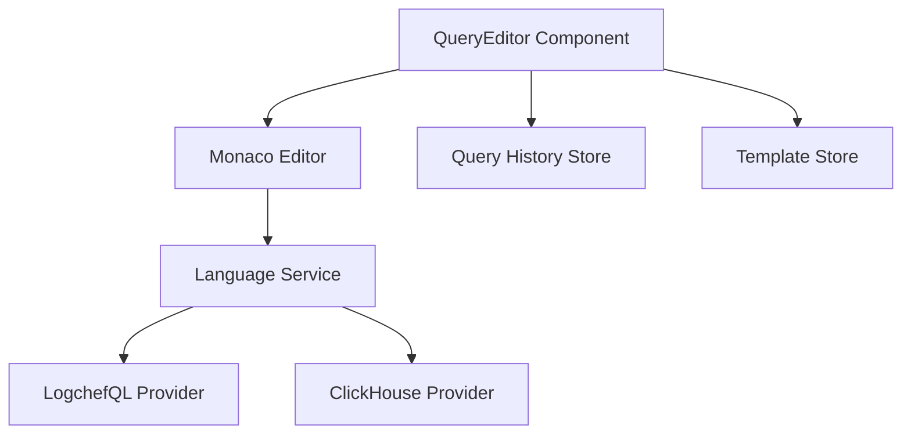

# Monaco Editor Integration for LogchefQL: Design Document

**Author:** System Architect
**Date:** 2024-03-19
**Task ID/Reference:** LOGCHEF-EDITOR-1

## 1. Overview

**Goal:**
Implement a powerful query editor for LogchefQL and ClickHouse SQL using Monaco Editor, with syntax highlighting, autocompletion, and query history support.

**Context:**
The LogchefQL API supports three query modes (basic, LogchefQL, and raw SQL). We need a robust editor component to help users write and manage these queries effectively.

**Key Outcomes:**
- Full Monaco Editor integration with Vue 3
- Language support for both LogchefQL and ClickHouse SQL
- Query history and template management
- Intelligent autocompletion for both languages

## 2. Background & Motivation

**Current State:**
- Basic text input for queries
- No syntax highlighting
- No autocompletion
- No query history

**Why This Task:**
- Improve user experience when writing queries
- Reduce errors through syntax highlighting and validation
- Speed up query writing with autocompletion
- Enable query reuse through history and templates

## 3. Requirements

**Functional Requirements:**

1. Editor Features:
   - Syntax highlighting for LogchefQL and ClickHouse SQL
   - Autocompletion for:
     - Table names and columns
     - LogchefQL operators and keywords
     - ClickHouse functions and keywords
   - Error highlighting
   - Format/prettify queries
   - Keyboard shortcuts (Ctrl/Cmd + Enter to execute)

2. Query Management:
   - Query history with search
   - Save favorite queries
   - Query templates
   - Share queries

**Non-Functional Requirements:**
- Editor load time under 500ms
- Autocompletion response under 100ms
- Smooth scrolling and editing for large queries
- Proper memory management

## 4. Proposed Solution

**Architecture:**



**Core Components:**

1. QueryEditor.vue:
```vue
<script setup lang="ts">
import { ref, onMounted, onBeforeUnmount } from 'vue'
import * as monaco from 'monaco-editor'
import { useQueryHistoryStore } from '@/stores/queryHistory'
import { useQueryTemplateStore } from '@/stores/queryTemplate'

// Component implementation
</script>

<template>
  <div class="query-editor">
    <div class="toolbar">
      <el-radio-group v-model="queryMode">
        <el-radio-button label="sql">SQL</el-radio-button>
        <el-radio-button label="logchefql">LogchefQL</el-radio-button>
      </el-radio-group>

      <el-button-group>
        <el-button @click="format">Format</el-button>
        <el-button @click="showHistory">History</el-button>
        <el-button @click="showTemplates">Templates</el-button>
      </el-button-group>
    </div>

    <div ref="editorContainer" class="editor-container" />
  </div>
</template>
```

2. Language Configuration:
```typescript
// languages/logchefql.ts
export const logchefQLLanguage = {
  id: 'logchefql',
  extensions: ['.logchefql'],
  aliases: ['LogchefQL'],
  mimetypes: ['application/x-logchefql'],

  // Token definitions
  tokenizer: {
    root: [
      [/[a-zA-Z_]\w*/, 'identifier'],
      [/'[^']*'/, 'string'],
      [/=|!=|~|!~|>|<|>=|<=/, 'operator'],
      [/;/, 'delimiter'],
      [/\d+(\.\d+)?/, 'number']
    ]
  }
}
```

3. Completion Provider:
```typescript
// completion/provider.ts
export class LogchefQLCompletionProvider implements monaco.languages.CompletionItemProvider {
  provideCompletionItems(
    model: monaco.editor.ITextModel,
    position: monaco.Position
  ): monaco.languages.ProviderResult<monaco.languages.CompletionList> {
    // Implementation
  }
}
```

## 5. Implementation Plan

1. **Phase 1: Basic Editor Setup**
   - Implement QueryEditor component
   - Add Monaco Editor integration
   - Basic syntax highlighting for both languages
   - Editor toolbar and mode switching

2. **Phase 2: Language Support**
   - Implement LogchefQL language definition
   - Add ClickHouse SQL language support
   - Basic autocompletion for keywords
   - Error highlighting

3. **Phase 3: Advanced Features**
   - Schema-aware autocompletion
   - Query history management
   - Template system
   - Query sharing

## 6. Testing Strategy

**Unit Tests:**
```typescript
describe('QueryEditor', () => {
  it('should switch language modes', async () => {
    const wrapper = mount(QueryEditor)
    await wrapper.find('.mode-sql').trigger('click')
    expect(wrapper.vm.editor.getModel().getLanguageId()).toBe('sql')
  })

  it('should provide completions', async () => {
    const wrapper = mount(QueryEditor)
    const completions = await wrapper.vm.getCompletions()
    expect(completions).toContain('service_name')
  })
})
```

## 7. Dependencies & Integration

- Monaco Editor
- Vue 3
- Pinia for state management
- Element Plus for UI components

## 8. Deployment & Rollout Plan

1. **Development:**
   - Implement in feature branch
   - Review bundle size impact
   - Optimize Monaco Editor loading

2. **Testing:**
   - Unit tests
   - Integration tests
   - Performance testing

3. **Production:**
   - Staged rollout
   - Monitor performance
   - Gather user feedback

## 9. Maintenance & Support

- Monitor editor performance
- Track error rates
- Collect usage metrics
- Regular updates to language definitions

## 10. Open Questions & Assumptions

1. **Questions:**
   - Should we implement a worker for syntax validation?
   - How to handle large query history?
   - Caching strategy for schema information?

2. **Assumptions:**
   - Monaco Editor bundle size is acceptable
   - Schema information is available via API
   - Users have modern browsers

## 11. Performance Considerations

1. **Editor Loading:**
   - Use dynamic imports for Monaco
   - Implement loading indicator
   - Consider web workers for heavy operations

2. **Memory Management:**
   - Proper cleanup of editor instances
   - Limit history size
   - Cache invalidation strategy

3. **Bundle Size:**
   - Only import required Monaco features
   - Code splitting for language support
   - Lazy load templates and history

## 12. Security Considerations

1. **Query Validation:**
   - Sanitize user input
   - Validate queries before execution
   - Rate limit API calls

2. **Data Storage:**
   - Secure storage of saved queries
   - Validate shared queries
   - User permission checks

This design provides a comprehensive plan for implementing a robust query editor with Monaco Editor, supporting both LogchefQL and ClickHouse SQL.