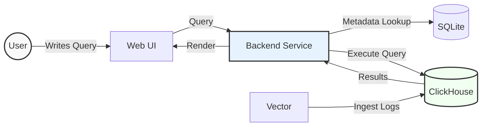

# Architecture Diagram

The following diagram illustrates the core data flow in LogChef:

## Flow Description

1. **Query Flow**

   - User writes a log query in the Web UI
   - Backend validates and processes the query
   - Results are fetched from ClickHouse and rendered in UI

2. **Data Storage**
   - ClickHouse: Stores and indexes log data
   - SQLite: Manages user permissions and metadata
   - Vector: Handles log ingestion

This simple architecture ensures fast log querying and efficient data management while maintaining a clean user experience.
