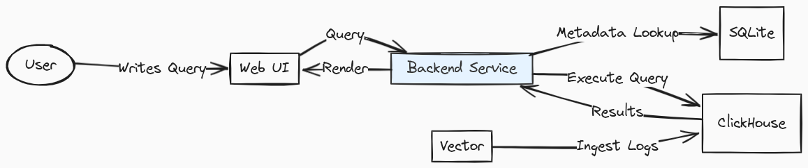

LogChef is a modern log analytics platform built with performance, scalability, and usability in mind. It consists of several key components working together to provide a seamless log exploration experience.

## System Overview

### Technology Stack

#### Backend

- **Go**: LogChef's core backend is written in Go, providing high performance, concurrency, and efficient resource utilization
- **SQLite**: Lightweight database used for metadata storage of users, teams, sources, and saved queries
- **ClickHouse**: High-performance columnar database optimized for analytical queries on log data
- **Vector**: Log ingestion and transformation pipeline

#### Frontend

- **Vue.js**: Modern JavaScript framework used to build the reactive user interface
- **Tailwind CSS**: Utility-first CSS framework for styling the UI components

## Core Components

### 1. Query Engine

- Converts simple search syntax to optimized ClickHouse SQL
- Manages query execution across multiple sources

### 2. Authentication Service

- Integrates with OIDC providers (like Keycloak, Zitadel etc)
- Manages user sessions and authorization
- Enforces role-based access control

### 3. Source Manager

- Manages connections to remote ClickHouse instances
- Handles source registration and validation
- Provides connection pooling mechanisms

## Data Storage

### SQLite Metadata Store

SQLite manages all system configuration and relationships:

- **Sources**: Connection details to remote ClickHouse databases
- **Users**: Account information and authentication data
- **Teams**: Organizational units with role-based access
- **Saved Queries**: Team-specific saved queries (supports both simple syntax and raw SQL)

### ClickHouse Log Storage

LogChef connects to multiple remote ClickHouse databases as sources:

- **Schema Flexibility**: Sources can:

  - Use the default OTEL schema as-is
  - Customize the built-in OpenTelemetry (OTEL) schema
  - Use custom schemas

- **Requirements**: Only a `timestamp` field (DateTime/DateTime64) is mandatory

- **Schema Agnostic**: Beyond `timestamp`, any column structure is supported

This architecture ensures:

- Fast log querying across multiple data sources
- Efficient metadata management
- Scalable log storage and retrieval
- Robust access controls
- Clean and responsive user experience
